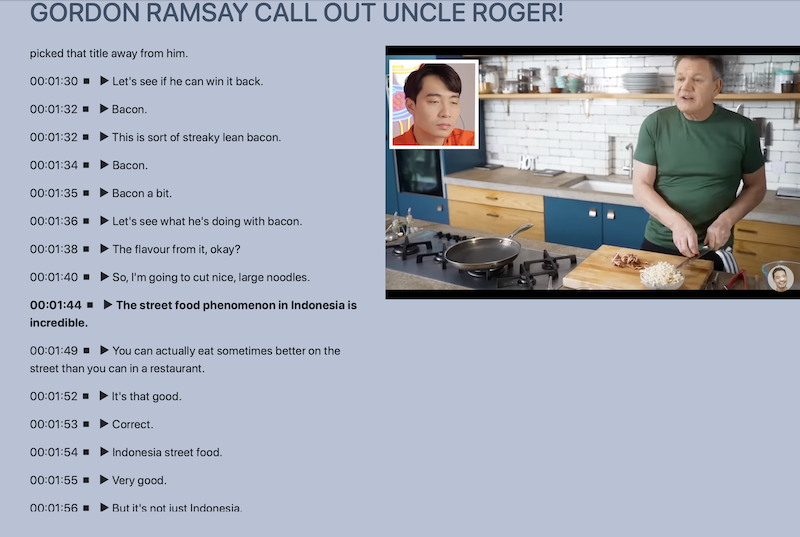

# Transcribe 

Transcribe is a Flask server that uses a combination of FFMpeg, yt-dlp (a fork of youtube-dl), and Whisper.cpp (https://github.com/ggerganov/whisper.cpp) to  create a transcription of audio (wav,mp3, etc), video(mp4, mkv, etc) and YouTube videos.

The transcription can be viewed and listened to  within a generated webpage, and for YouTube vidoes a side-by-side player is shown. The playback is matched to the transcription (see screenshots).


## Screenshots





## Requirements
Note - this has been developed and tested on an M1 Mac.  It should work on other systems but your mileage may vary (and I can't provide any support for these).

Python 3.8 - other versions may also work
ffmpeg (https://ffmpeg.org/download.html) - Required to convert to 16bit mono audio
whisper.cpp (https://github.com/ggerganov/whisper.cpp)

## Install

Install above dependancies

- FFMpeg needs to be sym-linked or copied into the instance folder as ffmpeg
- Whisper.cpp needs to be compiled and copied or sym-linked into the instance folder as `whisper`

(I'm be working on seeing if I can dynamically do this and maybe create a binding wrapper to directly integrate).

## Setup

**Setup automatically (mostly)**
`./setup.sh`

This will create the virtual environment, install dependancies, create necessary folders and database and download whisper model (base).  You still need to manually install ffpeg and whisper.

**Setup Manually**

```python3 -m venv venv
. ./venv/bin/activate
pip3 install --upgrade pip```

pip3 install -r requirements.txt

mkdir ./data ./data/waiting ./data/inprogress ./data/done 
mkdir ./instance ./instance/models

python3 -m scripts.init-db

wget --quiet --show-progress -O instance/models/ggml-base.bin https://huggingface.co/datasets/ggerganov/whisper.cpp/resolve/main/ggml-base.bin
```

## Usage

Activate the virtual environment
To Start, simply run `run.sh` (or manually using `python3 main.py`)

Then access it using `http://localhost:8080`

## Credits
This was inspired by David Smith's (https://mastodon.social/@_Davidsmith) PodSearch (https://podsearch.david-smith.org), and Web-Whisper (https://github.com/pluja/web-whisper)
